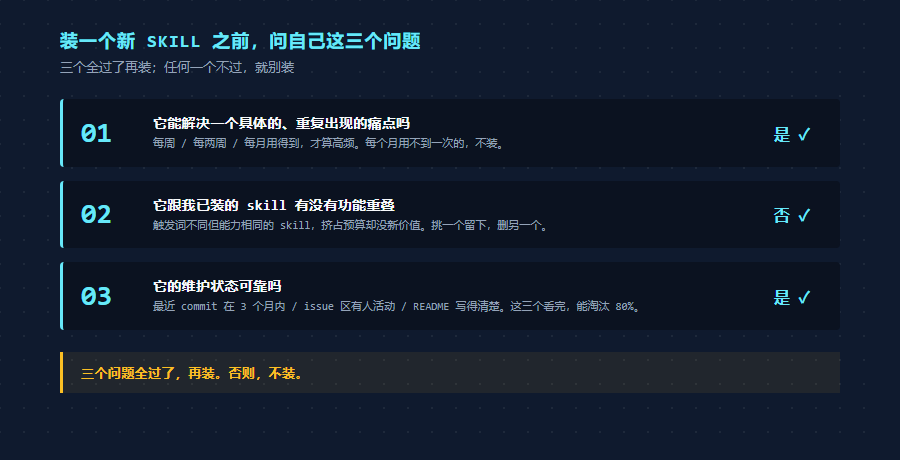

# 分享我觉得研究生必装的 13 个 Skill

> **装一堆没用的 skill，反而让 Claude 变笨。**

我装了 49 个 skill 之后，Claude Code 就开始变笨了。

这是真事，亲身踩过的坑。

那段时间我看公众号、刷推特、逛 GitHub 看大佬分享，看到一个有意思的 skill 就装上。装到第三十几个的时候，我开始感觉不太对劲。

让 Claude 帮我写公众号文章，它不调用 khazix-writer skill 了。让它整理记忆，它不调用 neat-freak 了。让它做横纵分析，它直接靠自己的常识在那儿瞎答，hv-analysis 就放在那儿，它就是想不起来用。

我以为是 skill 没装好，重装一遍，没用。我以为是触发词没匹配上，改提示词，没用。我以为是 Claude 的 bug，等了几天再试，还是没用。

后来才搞清楚，是 skill 装得太多了。

每装一个 skill，它的描述都会被预加载进 Claude 的系统提示词。装的多了，描述被自动压缩，关键词丢失，Claude 看不清每个 skill 是干嘛的，于是就懒得调用了。

所以这篇文章的开头，我必须先把这件事说在最前面。

skill 不是越多越好。

下面我会把我现在还在用的 13 个 skill 都列出来，每个都附一句话安装方式 + 我自己在什么场景下真的用过它。但在那之前，我得先把另一件事说清楚。

---

## Skill 到底是个什么东西

聊具体的 13 个 skill 之前，先用一句话说清楚 skill 是什么。

简单理解，**skill 就是装在 Claude 脑子里的反射弧**。

每个 skill 是一个 markdown 文件，里面写明了「我什么时候该被调用、被调用之后按什么流程做、有哪些注意事项」。装上之后，每次你跟 Claude Code 说话，Claude Code 都会先扫一遍所有 skill 的描述，看哪条跟你这次的请求最匹配。匹配到就**自动启用**。

注意，自动启用。

你不用手动敲 `/skill-name` 切换。比如你说「帮我写公众号文章」，khazix-writer skill 自己会跳出来接活。比如你说「研究一下 Harness Engineering」，hv-analysis 自己启动。比如你说「整理一下」，neat-freak 接管。

研究生时间贵，这件事很重要。**装好之后，剩下的事就是说人话，Claude 自己挑工具。**

但这里也有坑。装太多 skill，反射弧就会失灵，这是下面第一节要展开的事。

---

**本文导览**

- 一、装 Skill 之前，先看这三件事
- 二、研究生场景下，我真用得到的 13 个 Skill
- 三、Skill 不是越多越好，宁缺勿滥

---

## 一、装 Skill 之前，先看这三件事

我自己用了一年多 Claude Code，踩了几次坑后，沉淀下三件每次装新 skill 之前都该先过一遍的事。

### 第一件，skill 不是装得越多越好

这件事 Anthropic 官方文档里其实没明说，但他们的 skill 加载机制本身就告诉了你答案。

每装一个 skill，Claude Code 都会把这个 skill 的描述（也就是 SKILL.md 顶部 yaml 里的那段 description）预加载进系统提示词。这部分不是按需加载，是常驻。Claude 每次回应你，都得先扫一遍所有 skill 的描述，才知道有哪些工具可调。

预加载有预算。

每条 description 上限 1536 字符，所有 skill 的描述加起来大概有 8000 字符的总预算（约等于 context window 的 1%）。

装得少的时候没事。装到二三十个就开始挤，装到四五十个的时候，Claude Code 会自动把每条 description 压缩，砍掉它觉得不重要的关键词。

问题就出在这里。

被砍掉的关键词，往往恰好就是触发那个 skill 的关键词。skill 还在那儿，但 Claude 看不见它该什么时候被调用了。表现出来就是，明明装了 hv-analysis，让它做深度研究它愣是不调用，凭一身本事在那儿瞎答。

我自己的经验，当下健康的 skill 装机量大概是 12 到 15 个左右。这不是官方数字，也不是 Anthropic 公布过什么性能曲线，就是我从 49 个一路裁回来摸到的舒适区。

不是说装 30 个就一定崩。但你装到 30 个之后，每装一个新的，都得先问一句，这个 skill 能让我活得更好吗？还是只是看起来酷？

### 第二件，下载顺序，官方 > 大V > 个人

这是我个人的踩坑经验，不是官方建议，但我现在装任何 skill 之前都会自觉过一遍这个顺序。

第一档，**Anthropic 官方维护的 skill**。

仓库在 `https://github.com/anthropics/skills`。这里面的 skill 经过 Anthropic 自己内部团队反复打磨，描述精炼、流程稳健、跨平台适配过。docx、pptx、xlsx、pdf、frontend-design、skill-creator 这些都在这。装这一档的好处，不会出现「装了三个月之后没人维护」的情况。

第二档，**圈内大 V 维护的 skill**。

数字生命卡兹克的 khazix-skills 仓库，一泽 Eze 的 web-access，gstack 的 investigate / autoplan 这些。这些 skill 的描述写得很狠，触发词覆盖广，跟 Claude Code 的兼容性也经常更新。它们的好处在于，作者自己天天在用，所以问题暴露得快、修复得也快。

第三档，**个人项目里偶尔写的 skill**。

GitHub 上随手搜一下能搜出几百个。但很多是「我练手写的」，描述不规范、依赖不写清楚、半年没更新。装这一档之前，至少看一眼这个仓库最近有没有 commit、issue 区有没有人在维护。

我自己排查 skill 的时候，先打开 GitHub 仓库看 commit 频率，再看 issue 区有没有人活动，最后看 README 写得用不用心。这三个看完，能淘汰掉 80% 不靠谱的 skill。

### 第三件，每次装新 skill 之前，让 Claude Code 先帮你检查一下

这条是我最近半年才养成的习惯，给你贴一句直接 copy 就能用的咒语。

装新 skill 之前，对 Claude Code 说这一句。

> 我想装 X skill。请先帮我做三件事，第一，去 GitHub 搜一下这个 skill 的源仓库，看看维护状态。第二，对比一下它跟我已经装的 skill 有没有功能重叠或冲突。第三，告诉我装上之后对我的实际工作流帮助有多大。我根据你的回答再决定要不要装。

这句话能帮你过滤掉至少一半的「冲动装机」。

Claude Code 会自己去 GitHub 看仓库、扫你 `~/.claude/skills/` 已装的 SKILL.md 描述、然后判断必要性。如果它告诉你「这个跟你已装的 X skill 高度重叠，建议你二选一」，就别装了。

这套流程跑下来，平均每次装新 skill 都要花 5 分钟做研判。但你真的不会装那种回头一定要卸载的 skill。

第一节就到这。下面进入正题，我在用的 13 个 skill 一个一个介绍。

---

## 二、研究生场景下，我真用得到的 13 个 Skill

下面按使用频率从高到低过一遍。每个 skill 后面都附一句话给 Claude Code 的安装命令 + 我自己在什么场景下真的用过它。

记住前面说的，这些 skill 都是**装好就自动启用**的。装好之后你不需要记任何咒语，正常说人话就行，匹配到的 skill 自己会跳出来。

### 一、khazix-writer，公众号长文写作

数字生命卡兹克写的公众号长文 skill。这篇文章就是它写的。

它做的事情，把卡兹克在公众号上沉淀的一整套写作风格封装成 SKILL.md。包括开头钩子怎么写、节奏怎么把控、哪些词不能出现（说白了 / 意味着什么 / 本质上 这种被滥用的词）、最后跑四层自检（硬性规则、风格一致性、内容质量、活人感）。

**我自己怎么用它**，每次写公众号长文都走它。到目前为止用它发了两篇文章（上一篇「大模型时代复利的第一步，创建 CLAUDE.md」就是它写的），最大的好处是写完之后不用反复读自己的稿子改，自检流程会把那种「为新而新」「拼装感强」的句子直接揪出来。

触发方式是说「帮我写公众号文章」「按我的风格写一篇」这类话，它会自动跳出来。

安装命令，对 Claude Code 说，

> 帮我安装这个 skill，地址是 `https://github.com/KKKKhazix/khazix-skills/tree/main/khazix-writer`

它会自动 clone 到 `~/.claude/skills/khazix-writer/` 路径。

注意一点，这 skill 不能用来写学术论文。SKILL.md 里明确说不要用于 paper / 摘要 / Related Work，那种学术写作得用别的 skill 或者直接写 CLAUDE.md。

### 二、办公四件套（docx / pptx / xlsx / pdf），处理 Word PowerPoint Excel PDF

Anthropic 官方出品的四件套，公众号上有很多人推过。

不装这四个的时候，Claude Code 处理 Word 文档是从零摸索的，每次都现写一段 python-docx 的代码，效果随机。装上之后自带文档处理流程和代码模板，页面大小、字体、页眉页脚都有官方建议。

**我自己怎么用它**，用得最多的是 docx 和 pptx。docx 用来给我的论文做 Word 版本（IEEE 投稿要 PDF 但学校还要 Word 备案）。我之前试过让 Claude 自己用 python-docx 改 Word，结果文件直接被损坏，Word 能打开但没法保存，反复折腾浪费了一晚上。后来强制走 docx skill 的「unpack → 改 XML → pack」流程，一次就成功了。pptx 配合 frontend-design 一起用，做学术汇报 PPT 颜值能再上一个台阶。

触发方式，「帮我改一下这份 Word 文档」「生成一份 PPT」这类话直接说，会自动启用。

安装命令，对 Claude Code 说，

> 帮我装 Anthropic 官方的 docx pptx xlsx pdf 这四个 skill，仓库地址 `https://github.com/anthropics/skills`

注意，xlsx 和 pdf 我用得相对少。如果你不常处理 Excel 表格 / PDF 提取，可以只装 docx 和 pptx，没必要四个全装。

### 三、superpowers 全家桶，从想到做完整的工作流

这个最关键。如果你只能装一个，装这个。

superpowers 不是单一 skill，是一整个 plugin 包，里面有 14 个内置子 skill。把它们串起来就是一条完整的「想 → 设计 → 实现 → 验证 → 收尾」工作流。

我自己最常用的几个，brainstorming（开新项目时的需求探索）、writing-plans（把头脑风暴的东西落成可执行计划）、executing-plans（按计划逐步实现）、systematic-debugging（出 bug 了走根因分析而不是瞎试）、test-driven-development（写代码先写测试）。

这套东西最大的好处，它强迫你按工程的思路推进项目。

**我自己怎么用它**，我在 CLAUDE.md 里写了一条「开启新项目或非 trivial 修改时，默认用 brainstorming skill」。所以每次我开新坑（最近的两个，AutoEvo 算法演化框架、LLM-Wiki 知识库），Claude Code 上来就先跑 brainstorming，把需求探索清 95%，再跑 writing-plans 落任务清单，再 executing-plans 实现。每个项目下都会留下一份 `docs/superpowers/specs/` 设计文档，回头审稿的时候特别清楚。

触发方式，开新项目说「帮我设计 X」「我想做一个 Y」，brainstorming 自动启动。出 bug 说「这块为什么不工作」「帮我定位这个 bug」，systematic-debugging 自动启动。

安装命令，

> /plugin install superpowers@claude-plugins-official

这一条直接在 Claude Code 里输，回车就装好了。它从 Anthropic 官方的 plugin marketplace 拉。

### 四、autoplan，复杂项目跑三轮评审

gstack 套件里的一个 skill。superpowers 的好搭档。

它做的事，把一份实施计划从 CEO 视角、设计师视角、工程师视角分别 review 一遍，自动决策哪些点该改、哪些点保留，最后出一份打磨好的版本。如果你计划文档里有十几二十个 trade-off 点要决定，它一次性帮你全部决定完，不用一个个回答。

**我自己怎么用它**，在 CLAUDE.md 的「项目开发流程」里我写了「项目复杂或涉及架构决策时，跑 /autoplan；简单功能可跳过」。所以小修小补不跑，但凡涉及多文件改动、多模块联动、新引入依赖的，写完 plan 之后必跑一遍。最大的价值是它会主动暴露那些你自己没注意到的「品味决策」点，比如「这个 API 命名其实有更常见的方案」「这块代码该归在 utils 还是单独成文件」。

触发方式，写完 plan 文档之后说「帮我跑一下 autoplan」「auto review 这份计划」。

安装命令，

> 帮我装 gstack 套件中的 autoplan skill。先去 GitHub 搜一下源仓库再装。

### 五、neat-freak，知识库洁癖

这个 skill 是我个人体验最好的。

每次写代码、写文档、整理记忆告一段落，对 Claude Code 说一句「整理一下」，它就会启动 neat-freak。这 skill 会自动检查你的项目 CLAUDE.md、docs、Agent 记忆里有没有过期信息、有没有相互矛盾、有没有该删没删的临时记录，然后逐条修复。

它的强度很高。盘点是机械式枚举，每个文件都要明确标「评估过 / 要改 / 不用改」，不能跳过。最后还会跑一份「自检清单」逐条验证。

**我自己怎么用它**，每次会话告一段落（比如做完一个功能、写完一篇文章、跑完一轮实验），固定说一句「整理一下」或者「同步一下」。它会把这次会话产生的新事实写进 memory，把过期的旧事实删掉，把跨项目的影响也对齐。研究生写代码最容易掉的坑，文档跟代码不同步，记忆里写着「Sangfor 是性能瓶颈」，但其实那是三个月前的判断，现在已经验证过没问题了。这些过期信息攒多了，下一次 Claude 就基于错误前提做决策。neat-freak 就是定期帮你扫一遍。

触发方式，「整理一下」「同步文档」「梳理一下」「这个阶段做完了」都能触发。

安装命令，

> 帮我装 neat-freak skill。先去 GitHub 搜一下源仓库，确认作者和维护状态后再装。

注意，这是一个社区维护的 skill，不在 Anthropic 官方仓库里。让 Claude Code 自己去找最稳妥。

### 六、frontend-design，做前端 / PPT / 海报的品味救星

Anthropic 官方插件市场排名第一的 skill。

它解决一件事，AI 做前端容易掉的坑。比如默认字体永远是 Inter / Roboto / Arial，配色永远是紫色渐变配白底，按钮永远是圆角 + drop-shadow。这些都是 AI 模型在训练数据里见得最多的东西，懒省事就直接用，结果做出来的页面满屏「AI 味」。

frontend-design 的核心做法，强迫 AI 在写代码前先想清楚美学方向，是极简主义、复古未来风、新闻杂志风、还是日式禅意。然后排版、留白、字体、动效都围绕这个方向选。

**我自己怎么用它**，我在 GitHub 上的 Claude-Code-Guide 那两张封面就是用这 skill 做的，Terminal Luminance 视觉系统（深蓝黑底 + cyan 强调色 + 几何感）就是它帮我理出来的方向。这篇文章你看到的封面也是。配合 pptx 一起用，做出来的 PPT 颜值能比默认的好看一大截，我每次做组会 PPT 都是这两个 skill 一起调。

触发方式，「帮我做一张封面」「设计一个落地页」「做一个 dashboard」，它会先问你想要什么美学方向，再开始写代码。

最值得一说的，能力越差的模型，效果提升越明显。如果你用 Claude Sonnet 而不是 Opus，frontend-design 的提升肉眼可见。

安装命令，

> 帮我装 Anthropic 官方的 frontend-design skill，仓库 `https://github.com/anthropics/skills`

### 七、hv-analysis（横纵分析法），系统化做深度研究

数字生命卡兹克沉淀的方法论，做成 skill 之后我自己用着特别顺手。

它的核心思路，做一份深度研究报告，得有两个轴。

纵轴，时间轴，从这个东西诞生那天起到现在，完整的演变历程，叙事化呈现。横轴，时间截面上跟同类竞品的横向对比。两条轴交叉之后产出独到洞察，最后输出一份排版精美的 PDF。

这套方法是卡兹克揉了索绪尔的历时-共时分析、社会科学的纵向-横截面研究、商学院案例研究法和竞争战略分析得到的。学术味很重，但用起来很顺手。

**我自己怎么用它**，截至现在用过两次实战。一次是想搞清楚「Harness Engineering 这个概念是怎么来的」，让 Claude Code 跑一份 hv-analysis，它从 Anthropic 最早提出 harness 概念那天开始捋，再跟 OpenAI、AVO、FunSearch 这些同类思路横向对比，最后告诉我这条赛道的真实创新点在哪、谁在领跑、未来朝哪走。另一次是研究「小模型在电力系统调度里有没有蓝海机会」，输出来的 PDF 直接成了我后续选论文方向的核心参考资料。比我自己一个个看十几篇 paper 然后凭脑子总结快多了。

触发方式，「研究一下 X」「调研一下 Y」「帮我深度分析 Z」「帮我看看这个东西怎么样」都会触发。

安装命令，

> 帮我装这个 skill，地址 `https://github.com/KKKKhazix/khazix-skills/tree/main/hv-analysis`

注意，hv-analysis 跟 khazix-writer 是同一个仓库的两个子目录，所以你也可以一次把整个仓库 clone 下来。但我建议按需装，免得仓库内别的 skill 也被注入到 `~/.claude/skills/`。

### 八、investigate，系统化调试

gstack 维护的调试 skill。

它有一条「铁律」，没找到根因之前不能写修复代码。debug 分四个阶段，调查 → 分析 → 假设 → 实施。每个阶段输出物都要写到一个 debug-log 文件里，避免你查了半天忘了自己已经验证过哪些假设。

研究生写代码最容易出的事，问题没搞清楚就开始改，改完不行就再改一遍，掉进无限重试循环。investigate 就是用流程把这条路堵死。

**我自己怎么用它**，遇到那种「明明昨天还能跑」的诡异 bug 必走它。最印象深刻的一次，EvoHarness3 我的算法演化项目跑了 482 轮之后突然卡死，单看错误日志根本看不出问题。按 investigate 的四阶段一步步排查，最后定位到是 LLM 路径覆盖不全，单跑过假，一个完全反直觉的根因，我自己想破头都想不到，是 investigate 强制走「假设 + 验证」流程逼出来的。

触发方式，「这块为什么不 work」「帮我 debug 一下」「为什么昨天还好今天就崩了」，自动启动。

安装命令，

> 帮我装 gstack 套件中的 investigate skill。先去 GitHub 搜一下源仓库再装。

### 九、web-access，让 Claude Code 真的能上网

一泽 Eze 写的联网 skill。这个属于装一次受益终身的类型。

它做的事，Claude Code 默认的 WebFetch 工具只能访问公开网页，登录态的、动态渲染的、反爬严格的都拿不到。web-access 通过 Chrome DevTools Protocol 直连本地浏览器，带着你的登录态去抓内容。

小红书、B 站、微博、飞书、知识星球，这些站内内容都能读。还能自动沉淀每个网站的操作经验，按域名存操作记录。

**我自己怎么用它**，最多的场景是做调研让 Claude 直接去小红书上搜素材，比我自己一条一条复制粘贴快十倍。还有一次帮一个朋友写公众号文章，他说素材在他们组的飞书里，让 Claude Code 装着 web-access 直接去飞书拉，不用我手动从飞书 export。前几天我让它去爬两篇阿里云开发者公众号的文章看视觉风格也是它干的，连 24 张配图都给我下载到了本地。

触发方式，「去小红书搜一下 X」「帮我抓一下这个微信公众号文章」「访问一下我那个飞书文档」，自动调用。

注意，这 skill 装好之后需要 Chrome 最新版 + 允许远程调试（chrome://inspect/#remote-debugging）。如果不开调试端口，Claude Code 连不上你的浏览器。

安装命令，

> 帮我装 web-access skill，仓库地址 `https://github.com/eze-is/web-access`

### 十、Obsidian 三件套（obsidian-markdown / obsidian-bases / obsidian-cli），笔记与知识库

我最近刚装的。如果你用 Obsidian 做笔记或者搭知识库，这三个一起装。

obsidian-markdown 处理 Obsidian 自己的扩展语法（wikilink、callout、embed、property），让 Claude Code 写出来的 .md 笔记能直接被 Obsidian 解析。

obsidian-bases 处理 .base 文件，做数据库式视图。Obsidian 的 Bases 功能其实很强但配置麻烦，这 skill 帮你直接生成可用的 .base 文件。

obsidian-cli 调用 Obsidian CLI，从命令行操作 vault，搜笔记、查 task、改 property。

**我自己怎么用它**，我有一个 LLM-Wiki vault 在 D 盘，参考 Karpathy 的 LLM Wiki 模式搭的，目前里面 25 页核心笔记 + 4 篇我自己的论文 + 9 篇参考文献 + 3 篇 Harness Engineering 系列文章。装了三件套之后，让 Claude Code 帮我整理新笔记、补 frontmatter、重构 wikilink、生成索引页都顺很多。最近最常用的是「帮我把这篇刚抓下来的文章 ingest 进 wiki」这类指令。

触发方式，「整理一下我的 obsidian 笔记」「帮我搜一下 vault 里的 X」「在 LLM-Wiki 里加一篇关于 Y 的笔记」。

安装命令，

> 帮我装 obsidian-markdown obsidian-bases obsidian-cli 这三个 skill。先去 GitHub 搜一下源仓库再装。

### 十一、math-olympiad，给做奥数 / 竞赛题相关研究的同学

Anthropic 官方 plugin，专门处理数学奥林匹克级别的证明题和构造题。

装上之后，Claude Code 处理这类题目会自动启动一套更严格的推理流程，先给出严谨证明的草稿，再自己挑反例攻击，再修补。

**我自己怎么用它**，专业不是奥数方向，但偶尔做组合优化的边界证明会用。比如证明某个分布式优化算法的收敛速率上界，或者推导某个 ADMM 变种的最优步长，这些都需要奥数式的「先证后攻」思维。math-olympiad 的「反例攻击」环节比我自己单纯口头推导靠谱很多。

触发方式，「证明一下这个不等式」「这个上界对吗」「找一下这个证明的反例」。

如果你专业是应用数学、运筹优化、组合数学，这个 skill 强烈推荐。

安装命令，

> /plugin install math-olympiad@claude-plugins-official

跟 superpowers 一样是 Anthropic 官方 plugin marketplace 出品，一行装好。

### 十二、claude-md-management，给你的 CLAUDE.md 找个管家

Anthropic 官方 plugin。如果你看过我上一篇文章「大模型时代复利的第一步，创建 CLAUDE.md」，知道我有多看重 CLAUDE.md 这个东西。这个 plugin 就是 CLAUDE.md 的专属管家。

它做两件事。一件是 audit，扫描你项目里所有的 CLAUDE.md 文件，检查质量，给出修改建议（哪段太冗余、哪段缺关键信息、哪段过期）。另一件是从最近的会话里提炼新规则，建议你加进 CLAUDE.md 里。

**我自己怎么用它**，每个月会跑一次 audit，看看 CLAUDE.md 里有没有过期的规则，有没有该删的规则。比如三个月前我写的一条「优先用 GPT-4 而不是 Claude」，早就该改成 Claude 4.7 了，每次 audit 都会被它揪出来。每次会话结束如果产生了新的协作偏好（「以后这种场景我都希望你这样」），让它顺手把这条加进 CLAUDE.md。

触发方式，「audit 一下我的 CLAUDE.md」「revise CLAUDE.md based on this session」「检查一下 CLAUDE.md」。

安装命令，

> /plugin install claude-md-management@claude-plugins-official

### 十三、skill-creator，自己造 skill 的工具（我装了，但没用过）

这是个有点反差的安排。我装了 skill-creator，但到目前为止一个 skill 都没自己创建过。

理由很简单，上面这些 skill 已经覆盖了我研究生场景里 95% 的需求。剩下那 5%，要么用 CLAUDE.md 一段话搞定，要么是真的太冷门，造出来三个月用不上一次。

我反而想分享一句反共识的话。

skill-creator 的官方介绍里有一条，「最牛的 skill 永远是你自己造的那个」。这话没错。但这句话在 99% 的研究生身上不成立。

研究生最稀缺的不是「自己造一个 skill」的能力，而是「忍住不造的耐心」。每个 skill 都有维护成本、加载成本、上下文挤占成本。一个研究生项目周期大概 3 到 6 个月，你为这个项目造的 skill 在项目结束之后基本就废了。

更稳妥的姿势，先在 GitHub 上找现成的。

每次想造 skill 之前，对 Claude Code 说，

> 我想造一个做 X 的 skill。请先去 GitHub 搜一下，看看有没有现成的、维护良好的 skill 已经做了类似的事。如果有，告诉我那个 skill 的地址。如果真的没有，再帮我评估造一个的成本。

这条咒语让我至今没必要自己造过 skill。

skill-creator 仍然要装。当你真的要造的时候，它能帮你按规范走完创建 → 测试 → 评估 → 优化的全流程，不至于自己手搓 SKILL.md。

安装命令，

> 帮我装 Anthropic 官方的 skill-creator skill，仓库 `https://github.com/anthropics/skills`

第二节就到这里。下面收尾。

---

## 三、Skill 不是越多越好，宁缺勿滥

写到这里你应该看出来了，我整个第二节满打满算 13 个独立 skill 项（Obsidian 三件套和办公四件套各算一组）。

这跟我前面提到的 12 到 15 健康水位刚好对上。

不是巧合。

每装一个新 skill 之前，我都会问自己几个问题。

**第一，它能解决一个具体的、重复出现的痛点吗？**

khazix-writer 解决的是「公众号文章自检」，每周都要写。superpowers 解决的是「项目从想到做的工作流」，每个月都要开新坑。web-access 解决的是「让 Claude 真的能去带登录态的网站抓内容」，每两周都得用。这些都是高频痛点。

如果一个 skill 我估计每个月用不到一次，我就不装。

**第二，它跟我已装的 skill 有没有功能重叠？**

我看到过 GitHub 上有些 skill，跟 superpowers 里的 brainstorming 高度重叠，只是触发词不同。这种装上去除了挤占预算什么用没有。

**第三，它的维护状态可靠吗？**

最近 commit 是 3 个月内、issue 区有人活动、README 写得清楚。这三个看完，能淘汰掉 80% 的 skill。

如果三个问题都通过了，再装。

skill-creator 我装了但没用过，这件事不是因为 skill-creator 不好，是因为我没必要造 skill。

CLAUDE.md 能解决的，就别用 skill。能用一段话写在 CLAUDE.md 里的规则，就别封装成 SKILL.md。能用现成 skill 满足的，就别自己造。

这是研究生使用 Claude Code 最重要的一条心法，**复利来自克制，而不是堆叠**。

一年前我装到第 49 个 skill 的时候以为自己很高级。今天我裁回 13 个，反而觉得 Claude Code 比之前好用得多。

最后留一份「研究生必装清单」给你打表对照。

| 类型 | Skill | 优先级 |
|---|---|---|
| 写作 | khazix-writer（公众号）/ docx + pptx（论文与汇报） | 必装 |
| 工作流 | superpowers / autoplan / neat-freak | 必装 |
| 设计 | frontend-design | 必装 |
| 研究 | hv-analysis / investigate | 必装 |
| 联网 | web-access | 必装 |
| CLAUDE.md | claude-md-management | 必装 |
| 笔记 | obsidian 三件套 | 看你用不用 Obsidian |
| 学术 | math-olympiad | 看你研究方向 |
| 其他 | skill-creator | 装着，少用 |

这就是我研究生这两年沉淀下来的 skill 清单。

希望它能帮你少装一些没用的，多装一些救命的。

---

谢谢你阅读我的文章。
