# 分享我觉得研究生需要装的 13 个提升效率的 Skill

下面是我长期使用的 13 个 Claude Code skill，每个都附一句话安装方式 + 触发方式。它们是分工互补的一整套，相互之间没有冲突项，下面会逐一介绍。

---

## Skill 到底是个什么东西

先用一句话说清楚 skill 是什么。简单理解，**skill 就是装在 Claude 脑子里的反射弧和技能**。

每个 skill 是一个 markdown 文件，里面写明了「我什么时候该被调用、被调用之后按什么流程做、有哪些注意事项」。装上之后，每次你跟 Claude Code 说话，Claude Code 都会先扫一遍所有 skill 的描述，看哪条跟你这次的请求最匹配。匹配到就**自动启用**。

你不用手动敲 `/skill-name` 切换。比如你说「帮我写公众号文章」，khazix-writer skill 自己会跳出来接活。比如你说「研究一下 Harness Engineering」，hv-analysis 自己启动。比如你说「整理一下」，neat-freak 接管。

**装好之后，剩下的事就是说人话，Claude 自己挑工具。**

---

**本文导览**

- 一、研究生场景下，适合长期使用的 13 个 Skill
- 二、装 Skill 之前，先看这两件事
- 三、最后想推荐的一个公众号

---

## 一、研究生场景下，适合长期使用的 13 个 Skill

这 13 个 skill 不是同一类工具，是分工互补的一整套。先给你一张总览图，按场景挑着装，不必一次全上。

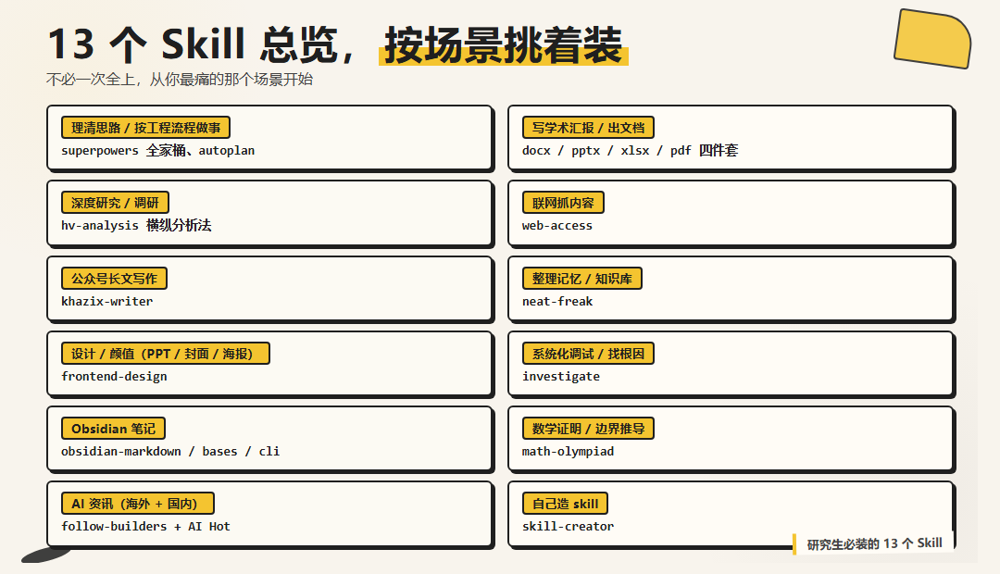

下面按场景一个一个详细介绍。

### 一、superpowers 全家桶，从想到做完整的工作流

这个最关键。如果你只能装一个，装这个。

superpowers 不是单一 skill，是一整个 plugin 包，里面有 14 个内置子 skill。把它们串起来就是一条完整的「想 → 设计 → 实现 → 验证 → 收尾」工作流。

我自己最常用的几个，brainstorming（开新项目时的需求探索）、writing-plans（把头脑风暴的东西落成可执行计划）、executing-plans（按计划逐步实现）、systematic-debugging（出 bug 了走根因分析而不是瞎试）、test-driven-development（写代码先写测试）。

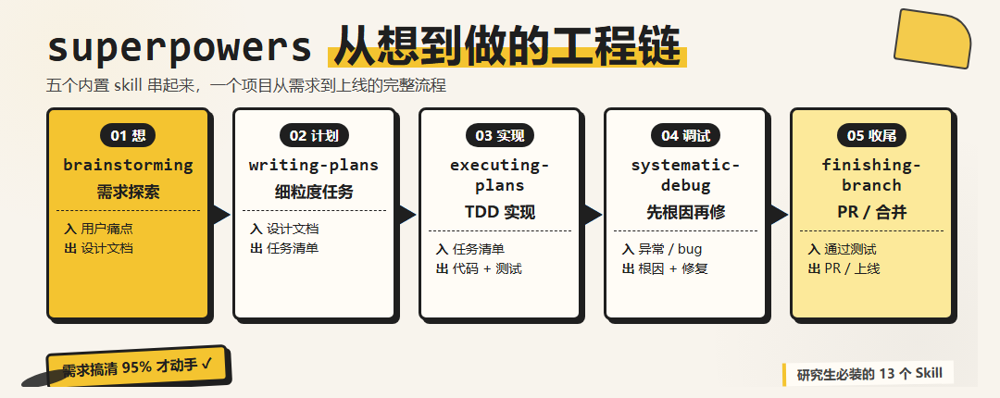

这套东西最大的好处，它强迫你按工程的思路推进项目。

触发方式，开新项目说「帮我设计 X」「我想做一个 Y」，brainstorming 自动启动。出 bug 说「这块为什么不工作」「帮我定位这个 bug」，systematic-debugging 自动启动。

一句话安装命令，对 Claude Code 说，

> /plugin install superpowers@claude-plugins-official

这一条直接在 Claude Code 里输，回车就装好了。它从 Anthropic 官方的 plugin marketplace 拉。

### 二、办公四件套（docx / pptx / xlsx / pdf），处理 Word PowerPoint Excel PDF

Anthropic 官方出品的四件套，公众号上有很多人推过。

不装这四个的时候，Claude Code 处理 Word 文档是从零摸索的，每次都现写一段 python-docx 的代码，效果随机。装上之后自带文档处理流程和代码模板，页面大小、字体、页眉页脚都有官方建议。

触发方式，「帮我改一下这份 Word 文档」「生成一份 PPT」这类话直接说，会自动启用。

一句话安装命令，对 Claude Code 说，

> 帮我装 Anthropic 官方的 docx pptx xlsx pdf 这四个 skill，仓库地址 `https://github.com/anthropics/skills`

注意，xlsx 和 pdf 我用得相对少。如果你不常处理 Excel 表格 / PDF 提取，可以只装 docx 和 pptx，没必要四个全装。

### 三、hv-analysis（横纵分析法），系统化做深度研究

数字生命卡兹克沉淀的调研方法论，做成 skill 之后我自己用着特别顺手。

它的核心思路，做一份深度研究报告，得有两个轴。纵轴，时间轴，从这个东西诞生那天起到现在，完整的演变历程，叙事化呈现。横轴，时间截面上跟同类竞品的横向对比。两条轴交叉之后产出独到洞察，最后输出一份排版精美的 PDF。

下面这一段，是我让 hv-analysis 跑「Harness Engineering 是怎么来的」时，输出的真实研究报告片段（纵轴叙事部分）。

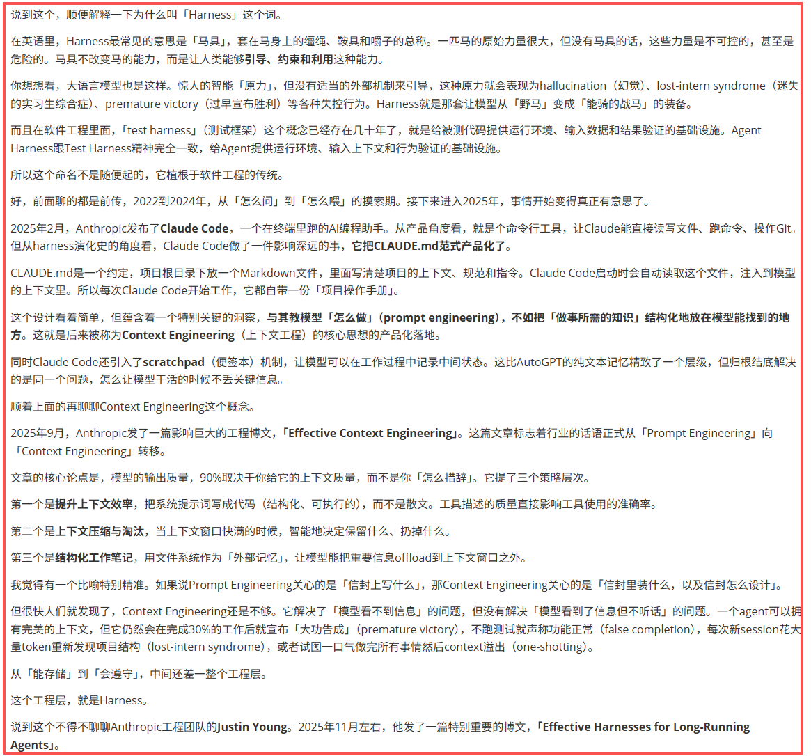

触发方式，「研究一下 X」「调研一下 Y」「帮我深度分析 Z」「帮我看看这个东西怎么样」都会触发。

一句话安装命令，对 Claude Code 说,

> 帮我装这个 skill，地址 `https://github.com/KKKKhazix/khazix-skills/tree/main/hv-analysis`

### 四、web-access，让 Claude Code 真的能上网

一泽 Eze 写的联网 skill。这个属于装一次受益终身的类型。

它做的事，Claude Code 默认的 WebFetch 工具只能访问公开网页，登录态的、动态渲染的、反爬严格的都拿不到。web-access 通过 Chrome DevTools Protocol 直连本地浏览器，带着你的登录态去抓内容。

小红书、B 站、微博、飞书、知识星球，这些站内内容都能读。还能自动沉淀每个网站的操作经验，按域名存操作记录。

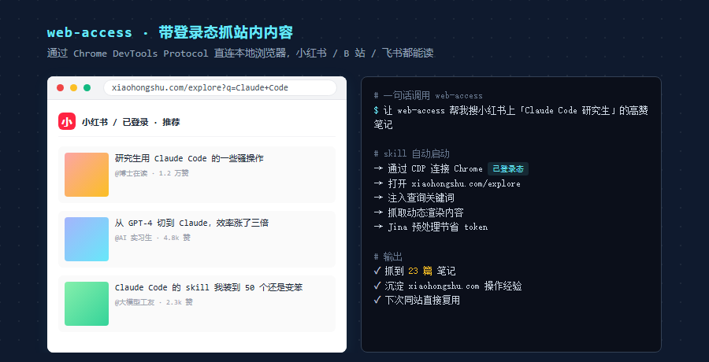

触发方式，「去小红书搜一下 X」「帮我抓一下这个微信公众号文章」「访问一下我那个飞书文档」，自动调用。

注意，这 skill 装好之后需要 Chrome 最新版 + 允许远程调试（chrome://inspect/#remote-debugging）。如果不开调试端口，Claude Code 连不上你的浏览器。

一句话安装命令，对 Claude Code 说，

> 帮我装 web-access skill，仓库地址 `https://github.com/eze-is/web-access`

### 五、khazix-writer，公众号长文写作

它做的事情，把卡兹克在公众号上沉淀的一整套写作风格封装成 SKILL.md。包括开头钩子怎么写、节奏怎么把控、哪些词不能出现（说白了 / 意味着什么 / 本质上 这种被滥用的词）、最后跑四层自检（硬性规则、风格一致性、内容质量、活人感）。

触发方式是说「帮我写公众号文章」「按我的风格写一篇」这类话，它会自动跳出来。

一句话安装命令，对 Claude Code 说，

> 帮我自动安装这个 skill，地址是 `https://github.com/KKKKhazix/khazix-skills/tree/main/khazix-writer`

它会自动 clone 到 `~/.claude/skills/khazix-writer/` 路径。

注意一点，这 skill 不能用来写学术论文。SKILL.md 里明确说不要用于 paper / 摘要 / Related Work，那种学术写作得用别的 skill 或者直接写 CLAUDE.md。

### 六、autoplan，复杂项目跑三轮评审

gstack 套件里的一个 skill。superpowers 的好搭档。

它做的事，把一份实施计划从 CEO 视角、设计师视角、工程师视角分别 review 一遍，自动决策哪些点该改、哪些点保留，最后出一份打磨好的版本。如果你计划文档里有十几二十个 trade-off 点要决定，它一次性帮你全部决定完，不用一个个回答。

触发方式，写完 plan 文档之后说「帮我跑一下 autoplan」「auto review 这份计划」。

一句话安装命令，对 Claude Code 说，

> 帮我装这个 skill，地址 `https://github.com/garrytan/gstack.git`，从仓库里取 autoplan 子目录

### 七、neat-freak，知识库洁癖

每次写代码、写文档、整理记忆告一段落，对 Claude Code 说一句「整理一下」，它就会启动 neat-freak。这 skill 会自动检查你的项目 CLAUDE.md、docs、Agent 记忆里有没有过期信息、有没有相互矛盾、有没有该删没删的临时记录，然后逐条修复。

它的强度很高。盘点是机械式枚举，每个文件都要明确标「评估过 / 要改 / 不用改」，不能跳过。最后还会跑一份「自检清单」逐条验证。

触发方式，「整理一下」「同步文档」「梳理一下」「这个阶段做完了」都能触发。

一句话安装命令，对 Claude Code 说，

> 帮我装这个 skill，地址 `https://github.com/KKKKhazix/khazix-skills.git`，从仓库里取 neat-freak 子目录

### 八、frontend-design，做前端 / PPT / 海报的品味救星

Anthropic 官方插件市场排名第一的 skill。

它解决一件事，AI 做前端容易掉的坑。比如默认字体永远是 Inter / Roboto / Arial，配色永远是紫色渐变配白底，按钮永远是圆角 + drop-shadow。这些都是 AI 模型在训练数据里见得最多的东西，懒省事就直接用，结果做出来的页面满屏「AI 味」。

frontend-design 的核心做法，强迫 AI 在写代码前先想清楚美学方向，是极简主义、复古未来风、新闻杂志风、还是日式禅意。然后排版、留白、字体、动效都围绕这个方向选。

触发方式，「帮我做一张封面」「设计一个落地页」「做一个 dashboard」，它会先问你想要什么美学方向，再开始写代码。

最值得一说的，能力越差的模型，效果提升越明显。如果你用 Claude Sonnet 而不是 Opus，frontend-design 的提升肉眼可见。

一句话安装命令，对 Claude Code 说，

> 帮我装 Anthropic 官方的 frontend-design skill，仓库 `https://github.com/anthropics/skills`

### 九、investigate，系统化调试

gstack 维护的调试 skill，跟 autoplan 在同一个仓库。

它有一条「铁律」，没找到根因之前不能写修复代码。debug 分四个阶段，调查 → 分析 → 假设 → 实施。每个阶段输出物都要写到一个 debug-log 文件里，避免你查了半天忘了自己已经验证过哪些假设。

研究生写代码最容易出的事，问题没搞清楚就开始改，改完不行就再改一遍，掉进无限重试循环。investigate 就是用流程把这条路堵死。

触发方式，「这块为什么不 work」「帮我 debug 一下」「为什么昨天还好今天就崩了」，自动启动。

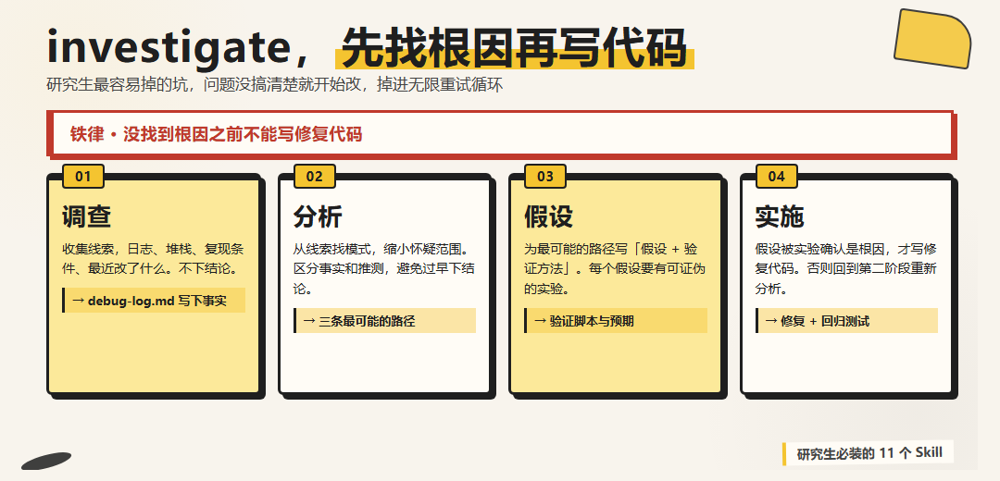

一句话安装命令，对 Claude Code 说，

> 帮我装这个 skill，地址 `https://github.com/garrytan/gstack.git`，从仓库里取 investigate 子目录

### 十、Obsidian 三件套（obsidian-markdown / obsidian-bases / obsidian-cli），笔记与知识库

我最近刚装的。如果你用 Obsidian 做笔记或者搭知识库，这三个一起装。

obsidian-markdown 处理 Obsidian 自己的扩展语法（wikilink、callout、embed、property），让 Claude Code 写出来的 .md 笔记能直接被 Obsidian 解析。

obsidian-bases 处理 .base 文件，做数据库式视图。Obsidian 的 Bases 功能其实很强但配置麻烦，这 skill 帮你直接生成可用的 .base 文件。

obsidian-cli 调用 Obsidian CLI，从命令行操作 vault，搜笔记、查 task、改 property。

下面这一段，是用 obsidian 搭建的个人知识库连线图，看着还挺炫的，每个知识点都可以看到连接了哪些其他知识点。

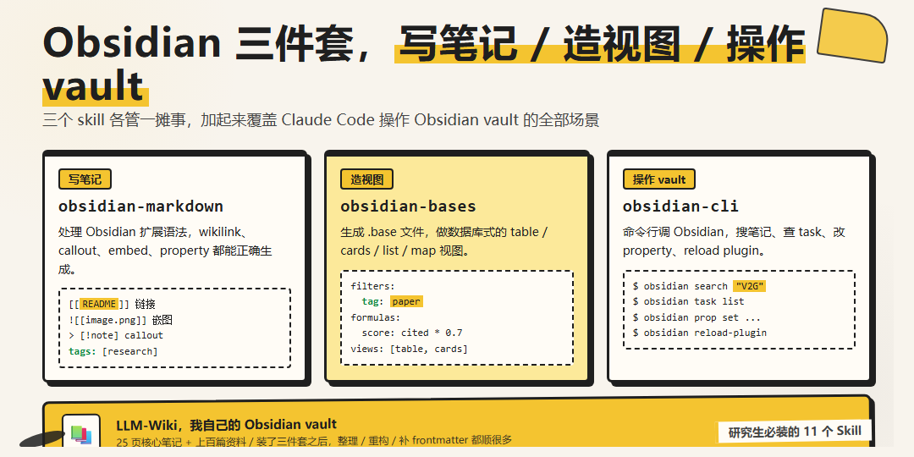

触发方式，「整理一下我的 obsidian 笔记」「帮我搜一下 vault 里的 X」「在 LLM-Wiki 里加一篇关于 Y 的笔记」。

一句话安装命令，对 Claude Code 说，

> 帮我装 obsidian-markdown obsidian-bases obsidian-cli 这三个 skill，地址 https://github.com/kepano/obsidian-skills.git。

### 十一、math-olympiad，给做奥数 / 竞赛题相关研究的同学

Anthropic 官方 plugin，专门处理数学奥林匹克级别的证明题和构造题。

装上之后，Claude Code 处理这类题目会自动启动一套更严格的推理流程，先给出严谨证明的草稿，再自己挑反例攻击，再修补。

触发方式，「证明一下这个不等式」「这个上界对吗」「找一下这个证明的反例」。

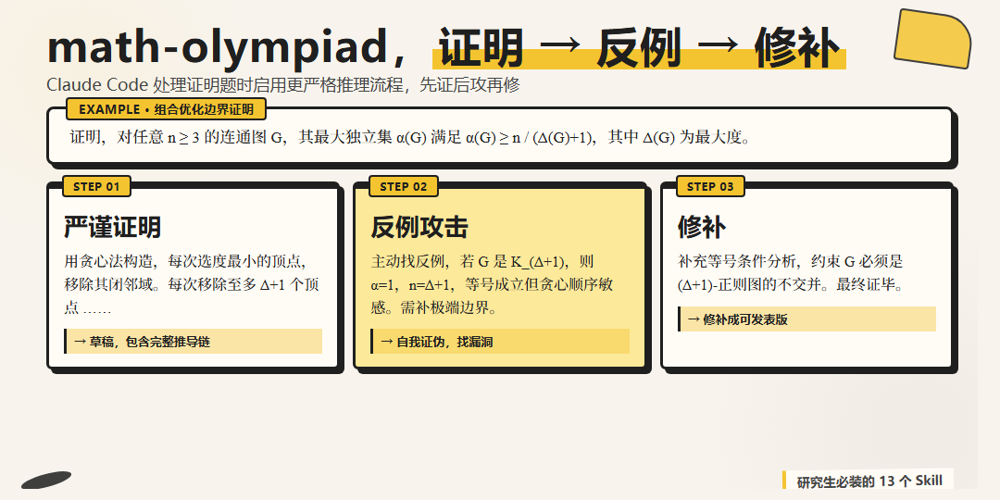

如果你专业是应用数学、运筹优化、组合数学，这个 skill 强烈推荐。

一句话安装命令，对 Claude Code 说，

> /plugin install math-olympiad@claude-plugins-official

跟 superpowers 一样是 Anthropic 官方 plugin marketplace 出品，一行装好。

### 十二、follow-builders，AI 资讯爆炸时代的官方信息源筛选器

大模型这两年信息密度太高了。每天 X、公众号、Hacker News、各种博客一起刷，刷半天读到的全是二手三手转述。**消息来源**这件事，今天比以往任何时候都重要。

follow-builders 解决的就是这个事。它把一批高信号源整理成一个白名单，包括 Anthropic / OpenAI / xAI / Google DeepMind 这些公司的官方账号，Anthropic 团队成员，YC 总裁 Garry Tan，Box CEO Aaron Levie，还有一堆活跃在一线的 AI builder 推主。每天帮你抓他们的最新动态，做中文翻译加重点提取，最后输出成一份干净的简报。

跟自己刷 X 不一样的是，它不会把广告、转发、抽奖、吵架混进来，只保留 builder 自己写的原创内容。AI 资讯基本看它就够了，省下来的时间用来真正干活。

下面这一段，就是它前两天给我的简报片段，原推 + 中文翻译并排。Anthropic 的 Alex Albert、Box CEO Aaron Levie、YC 总裁 Garry Tan 的最新发言一目了然。

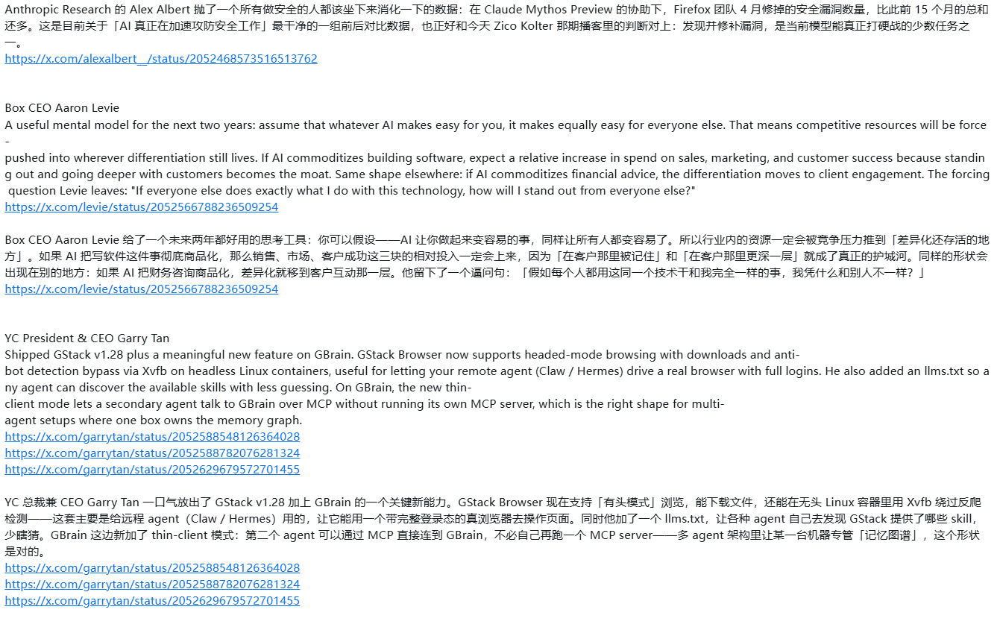

触发方式，「今天 AI 圈有什么新东西」「最近 builder 们在聊什么」「给我做一份 AI 日报」，自动调用。

一句话安装命令，对 Claude Code 说，

> 帮我装这个 skill，地址 `https://github.com/zarazhangrui/follow-builders.git`

**补充一个中文向的搭档，AI Hot**。follow-builders 抓的是英文 X 上的一线 builder，覆盖海外动态。中文圈的 AI 热点它够不到，这就是数字生命卡兹克最近开源的 AI Hot 派上用场的地方。AI Hot 是中文 AI 资讯查询 skill，专门盯国内 AI 圈的发布、模型、产品、论文、行业动态，正好跟 follow-builders 一英一中互补。

我自己的搭配，每天打开 Claude Code 先说「给我做一份 AI 日报」走 follow-builders，再说「今天 AI HOT 有什么」走 AI Hot，海外 + 国内两边一次看完，比我过去刷半小时 X 加半小时公众号效率高得多。

一句话安装命令，对 Claude Code 说，

> 帮我装 AI Hot skill，地址 `https://aihot.virxact.com/aihot-skill/`

### 十三、skill-creator，自己造 skill 的工具（我装了，但没用过）

这是个有点反差的安排。我装了 skill-creator，但到目前为止一个 skill 都没自己创建过。

理由很简单，上面这些 skill 已经覆盖了我研究生场景里 95% 的需求。剩下那 5%，要么用 CLAUDE.md 一段话搞定，要么是真的太冷门，造出来三个月用不上一次。

skill-creator 的官方介绍里有一条，「最牛的 skill 永远是你自己造的那个」。这话没错。但这句话在研究生身上可能不成立。

研究生最稀缺的不是「自己造一个 skill」的能力，而是「忍住不造的耐心」。每个 skill 都有维护成本、加载成本、上下文挤占成本。一个研究生项目周期大概 3 到 6 个月，你为这个项目造的 skill 在项目结束之后基本就废了。

更稳妥的姿势，先在 GitHub 上找现成的。

每次想造 skill 之前，对 Claude Code 说，

> 我想造一个做 X 的 skill。请先去 GitHub 搜一下，看看有没有现成的、维护良好的 skill 已经做了类似的事。如果有，告诉我那个 skill 的地址。如果真的没有，再帮我评估造一个的成本。

这条咒语让我至今没必要自己造过 skill。

skill-creator 仍然要装。当你真的要造的时候，它能帮你按规范走完创建 → 测试 → 评估 → 优化的全流程，不至于自己手搓 SKILL.md。

skill-creator 跟前面的 docx / pptx / frontend-design 在同一个 Anthropic 官方仓库 `https://github.com/anthropics/skills`。如果你前面装那批的时候是整个仓库 clone 下来的，skill-creator 已经在里面了，不用再单独装。

---

## 二、装 Skill 之前，先看这两件事

讲完 13 个 skill，反过来说一句反共识的话，**skill 不是越多越好**。

每装一个 skill，它的描述都会被预加载进 Claude 的系统提示词。装的多了，描述被自动压缩，关键词丢失，Claude 看不清每个 skill 是干嘛的，于是就懒得调用了。我自己装到 49 个的时候，明明装了 khazix-writer 让它写公众号，它就是不调用，最后只能裁回 13 个。

所以装新 skill 之前，有两件事每次都该过一遍。

### 第一件，下载顺序，官方 > 大V > 个人

这是我个人的踩坑经验，不是官方建议，但我现在装任何 skill 之前都会自觉过一遍这个顺序。

第一档，**Anthropic 官方维护的 skill**。

仓库在 `https://github.com/anthropics/skills`。这里面的 skill 经过 Anthropic 自己内部团队反复打磨，描述精炼、流程稳健、跨平台适配过。docx、pptx、xlsx、pdf、frontend-design、skill-creator 这些都在这。装这一档的好处，来源非常可靠。

第二档，**圈内大 V 维护或启发的 skill**。

数字生命卡兹克的 khazix-skills 仓库（khazix-writer / hv-analysis / neat-freak / AI Hot 都在这），一泽 Eze 的 web-access，gstack 的 investigate / autoplan，这是圈内主要在维护 skill 的几位。还有像 Karpathy 这种顶级大 V，他自己虽然没专门做 skill 仓库，但他开源的 LLM Wiki 个人知识库范式启发了一大批笔记 / 知识库类 skill 的设计思路。这一档的特点，触发词写得狠，跟 Claude Code 的兼容性更新得勤。

第三档，**个人项目里偶尔写的 skill**。

GitHub 上随手搜一下能搜出几百个。但很多是「我练手写的」，描述不规范、依赖不写清楚、半年没更新。装这一档之前，至少看一眼这个仓库最近有没有 commit、issue 区有没有人在维护。

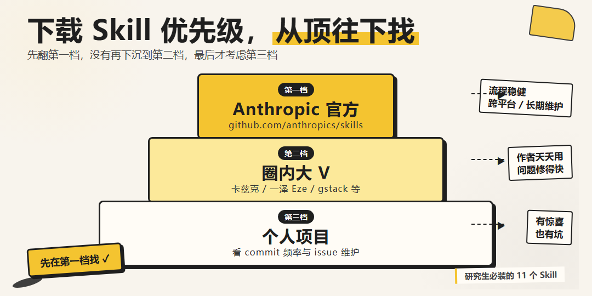

我自己排查 skill 的时候，主要还是得看来源，来源不明的 skill 需要非常慎重。

### 第二件，每次装新 skill 之前，可以让 Claude Code 先帮你检查一下

装新 skill 之前，可以对 Claude Code 说这一句，让它先检查一下与目前 skill 的冲突和安装必要性。

> ***（skill 链接）。请帮我检查这个 skill，看看其有什么作用，安装的必要性和目前 skill 冲突。

这句话能帮你过滤掉至少一半的「冲动装机」。

Claude Code 会自己去 GitHub 看仓库、扫你 `~/.claude/skills/` 已装的 SKILL.md 描述、然后判断必要性。如果它告诉你「这个跟你已装的 X skill 高度重叠，建议你二选一」，就可以选择其中一个来装。

下面这张图，就是我前两天差点装 `/feature-dev` 这个 skill 时，让 Claude Code 跑这条咒语的真实输出。它逐项对照了 feature-dev 跟我现有 superpowers 流程的覆盖关系，最后建议我别装，理由是会跟现有流程产生路径冲突。

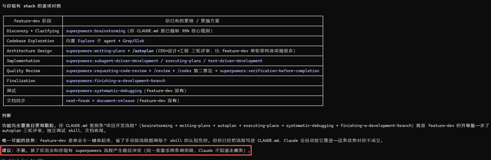

---

## 三、最后想推荐的一个公众号

这篇文章里你应该已经注意到了，反复出现了 khazix-writer、hv-analysis、neat-freak、AI Hot 这几个 skill，全部都是同一个人写的，**数字生命卡兹克**。我这两年关于 AI 工具、大模型用法、Claude Code 心得，很大一部分是从他公众号那儿学的。

---

最后留一份「研究生必装清单」给你打表对照。

| 类型 | Skill | 优先级 |
|---|---|---|
| 写作 | khazix-writer（公众号）/ docx + pptx（论文与汇报） | 必装 |
| 工作流 | superpowers / autoplan / neat-freak | 必装 |
| 设计 | frontend-design | 必装 |
| 研究 | hv-analysis / investigate | 必装 |
| 联网 | web-access | 必装 |
| AI 资讯 | follow-builders + AI Hot | 必装 |
| 笔记 | obsidian 三件套 | 看你用不用 Obsidian |
| 学术 | math-olympiad | 看你研究方向 |
| 其他 | skill-creator | 装着，少用 |

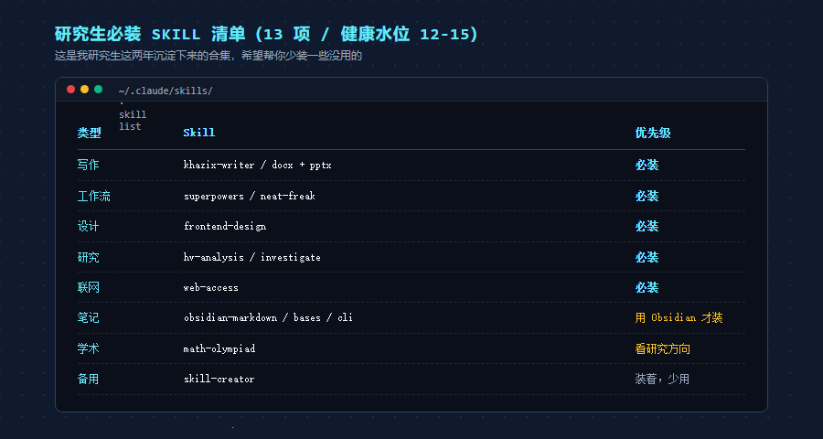

希望这些 skill 能帮你放大你的能力，节约你的 token。

---

谢谢你阅读我的文章。
